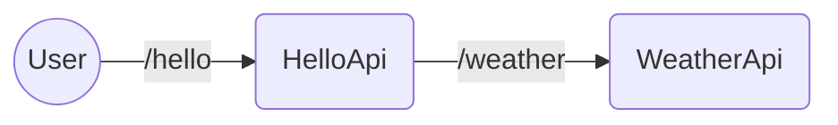
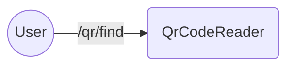

# javaapptroubleshooting-meetup

## Thread dump - sample application diagram

```mermaid
graph LR;
    A((User))-->|/hello|B(HelloApi);
    B(HelloApi)-->|/weather|C(WeatherApi);
```

## Heap dump - sample application diagram

```mermaid
graph LR;
    A((User))-->|/qr/find|B(QrCodeReader);
```

