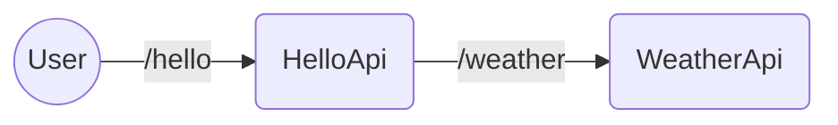
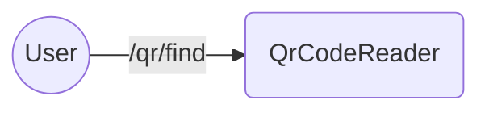

# javaapptroubleshooting-meetup

## Thread dump - sample application diagram

## Heap dump - sample application diagram

VM Options:

    -Xmx72m -Xlog:gc*:file=logsgc.log:tags,uptime,time,level:filecount=1,filesize=50m
